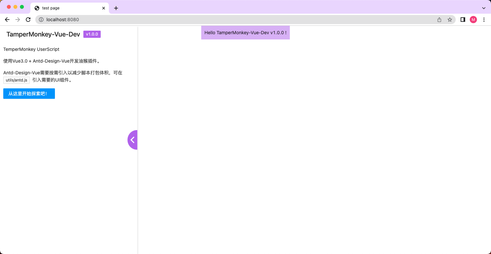
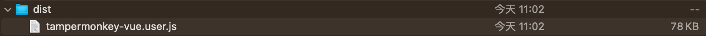
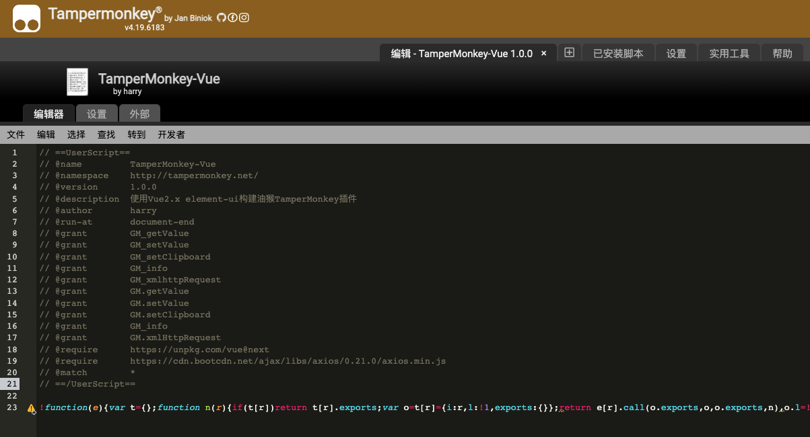

# Tampermonkey-Vue
使用 Vue 3.0 + Antd-Design-Vue 开发油猴插件（Tampermonkey）。

如果需要使用 Vue 2.0 + Eelement-UI 请使用`vue2.0`分支。

## 安装Tampermonkey插件
请在浏览器安装[Tampermonkey](https://tampermonkey.net/)插件。

安装Tampermonkey插件后，可以点击插件选择`添加新脚本`，然后复制粘贴当前项目下`dist/tampermonkey-vue.user.js`的代码，`Ctrl+S`保存后，刷新浏览器即可预览效果。

## 配置

### 本地开发
本地开发支持热更新，启动：
```
npm run dev
```
然后在浏览器访问：
```
http://localhost:8080/
```


可以在`.env.dev`进行开发环境的配置
``` js
// 插件运行环境
TAMPERMONKEY_APP_ENVIRONMENT=development
// 插件名称
TAMPERMONKEY_APP_NAME=TamperMonkey-Vue-Dev
// 插件打包生成的文件，Tampermonkey插件的入口文件，注意格式应该为：*.user.js
TAMPERMONKEY_ENTRY_FILE=tampermonkey-vue.user.js

```

### 打包发布
```
npm run build
```

可以在`.env`进行生产环境的配置，插件的版本号使用的是`package.json`的`version`版本号。
```js
// 插件运行环境
TAMPERMONKEY_APP_ENVIRONMENT=production
// 插件名称
TAMPERMONKEY_APP_NAME=TamperMonkey-Vue
// 插件打包生成的文件，Tampermonkey插件的入口文件，注意格式应该为：*.user.js
TAMPERMONKEY_ENTRY_FILE=tampermonkey-vue.user.js
```

打包完成后，在`dist`目录下会生成`tampermonkey-vue.user.js`文件，把该文件里的代码复制到Tampermonkey编辑器即可运行。




### Tampermonkey配置
可以在`tampermonkey.js`文件，配置Tampermonkey选项。

## 写在最后
Antd-Design-Vue UI框架代码会打包到脚本文件，所以体积会比较大。因此Antd-Design-Vue需要按需引入以减少脚本打包体积，可在`utils/antd.js`里引入需要的UI组件。